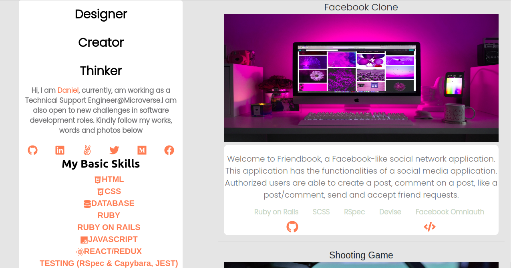
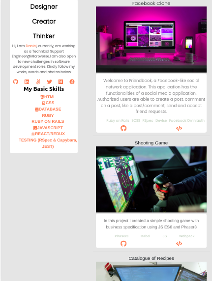
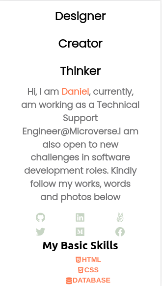

# My Portfolio 

> Using react to build my personalized portfolio with the help of gitconnected API. I extracted data from the API for the page


## Screenshots






## Built With

- React
- CSS
- Bootstrap
- GSAP
- React-Reveal


### Live version

* [Portfolio](www.daniellarbiaddo.com/)

## Getting Started

To get a local copy up and running follow these simple example steps.

1. ``` git clone https://github.com/addod19/portfolio.git ```
2. ``` cd portfolio ```
3. ``` yarn install or npm i ```
4. ``` yarn start or npm start ```
5. Explore my portfolio site

## Deployment

- ``` run npm build or yarn build ```
- ``` git add . git commit -m "ready for deployment" ```
- ``` git push ```
- Set up the app in netlify
- Deploy 

### Prerequisites

- A modern browser
- Nodejs

### Future Update ```v.1.1```

- I would add typejs animation
- Improve the UI

## Authors

👤 **Daniel Larbi Addo**

- Github: [@addod19](https://github.com/addod19)
- Twitter: [@DanielLarbiAdd1](https://twitter.com/DanielLarbiAdd1)
- Linkedin: [Daniel Larbi Addo](https://linkedin.com/in/daniel-larbi-addo/)
- Email: (addodaniellarbi@gmail.com)


## 🤝 Contributing

Contributions, issues and feature requests are welcome!

Feel free to check the [issues page](https://github.com/addod19/portfolio/issues).


1. Fork it (https://github.com/addod19/portfolio/fork)
2. Create your feature branch (git checkout -b my-new-feature)
3. Commit your changes (git commit -am 'Add some feature')
4. Push to the branch (git push origin my-new-feature)
5. Create a new Pull Request

## Show your support

Give us a ⭐️ if you like this project!

## Acknowledgments

- Microverse
- Microverse TSE's


## 📝 License

This project is [Apache](lic.url) licensed.
